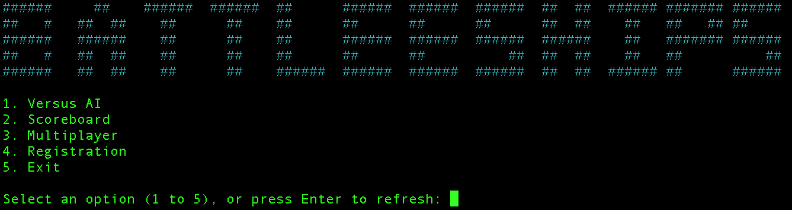

# ENGG1340 - Battleship Game 🏴‍☠️
This project is a console-based implementation of the classic **Battleship game** with multiple features, created for HKU's ENGG1340. Players can play against an AI opponent with different difficulty levels, challenge another player in local multiplayer mode, track scores on a leaderboard, and register as users to save their progress. The game follows standard Battleship rules where players place ships on a grid and take turns guessing coordinates to sink their opponent's ships. The first player to sink all of their opponent's ships wins.

## Team Members 🧑‍💻
- **Ilyas Toleutay** - Interface Design (Main menu and animations)
- **Aleksandr Vaskin** - Multiplayer implementation
- **Yerassyl Taisarinov** - AI/Computer player algorithm and gameplay mechanics
- **Altynai Akayeva** - AI/Computer player algorithm and main gameplay structure
- **Milan Giliazetdino**v - Authentication, Scoreboard

## How to Play ❓

### Compilation

Use the included `Makefile` to compile and run the game:

```bash
make start
```

If you encounter an error, clean up and try again:

```bash
make clean
make start
```

> **Note:** During the fame, follow the on-screen instructions carefully. You may be asked to type keywords, press `Enter`, or use a specific input format.

---

### Main Menu Options

When you start the game, you'll see a main menu like this:



Choose an option (1–5):

#### 1. Versus AI
- Select your desired difficulty level.
- Place your ships on the board.
- Take turns with the AI until one player **wins**.

#### 2. Scoreboard
- View the scores of all players saved in the database.
- Every player starts with a score of **600**.

#### 3. Multiplayer Mode
- Two players are **required** to play.
- Players must register/login into an account to play.
- Each player places their ships on their own board.
- Players take turns attacking each other's boards.
- During gameplay, **two boards** are displayed:
  - **Your target board:** where you shoot.
  - **Your own board:** where your opponent shoots.
- Remember to exit the game by returning to the main menu and picking Option 5 in order for the scores to be saved into the databa.se

> **Important:** Once ships are placed, you won't see them again during the game to prevent your opponent (sitting nearby) from seeing your ship locations.

#### 4. Registration
- Register for an account to use in multiplayer mode.


## Code Requirements 💻

### 1. Generation of Random Events
- **Random Ship Placement**: The AI opponent randomly places ships on the board when starting a new game.
- **AI Move Generation**: At lower difficulty levels, the AI makes random moves when attacking the player's board.
- **Supported by**: Various randomized functions in `battleship.cpp`, such as `placeRandomShips()` which utilizes random number generation to place ships on the board.

### 2. Data Structures for Storing Data
- **2D Arrays**: The game uses 2D arrays to represent the game boards for both players.
- **User Information**: Hash maps (`unordered_map`) store user information including usernames, password hashes, and scores.
- **Leaderboard**: A vector of pointers to User objects maintains the leaderboard.
- **Attack Records**: A vector of custom structs tracks the AI's attack patterns at higher difficulty levels.
- **Supported by**: Data structures defined in `battleship.h`, `users.h`, and used throughout the codebase.

### 3. Dynamic Memory Management
- **User Management**: Pointers to User objects are used in the leaderboard and for logged-in players.
- **AI Algorithm**: The attack logic for harder difficulty levels uses dynamic memory allocation to track successful hits and plan subsequent moves.
- **Supported by**: Dynamic allocation in `multiplayer.cpp` and user management in `users.cpp`.

### 4. File Input/Output
- **User Database**: Player information is stored in and loaded from a database file, while the passwords are hashed for security reasons.
- **Saving Game State**: The game saves user scores and rankings to persistent storage.
- **Supported by**: File operations in `users.cpp`, particularly in the `buildUsers()` and `saveUsers()` functions.

### 5. Program Codes in Multiple Files
The project is organized into multiple directories and files:
- **Main Game Logic**: `battleship.cpp/h` in the 1340_Group_Project directory
- **User Interface**: `main_menu.cpp/h` at the root level
- **Data Handling**: `users.cpp/h` and `constants.h` in the DataHandling directory
- **Multiplayer**: `multiplayer.cpp/h` in the Multiplayer directory

### Multiple Difficulty Levels
The game features four difficulty levels for the AI opponent:
1. **Easy**: Random targeting with no strategy
3. **Medium**: Advanced targeting with ship-hunting algorithm
4. **Hard**: Sophisticated algorithm that uses probability maps to predict ship locations

### C/C++ Libraries
This project only uses standard C++ libraries, including:
- `<iostream>` - For input/output operations
- `<string>` - For string manipulation
- `<vector>` - For dynamic arrays
- `<unordered_map>` - For hash maps (user data)
- `<fstream>` - For file operations
- `<cstdlib>` - For random number generation and system commands
- `<ctime>` - For seeding random number generation
- `<algorithm>` - For sorting and other algorithms
- `<iomanip>` - For output formatting
- `<limits>` - For 

## Innovative Features 🌊

We included several unique features to modernise the classic game of Battleships 

### Sophisticated AI Opponent 🕵️
> Various AI difficulty levels with differing approaches

The AI in our program operates at multiple difficulty levels:
-   **Easy:** Employs random targeting for a casual experience.
-   **Medium:** Utilizes a targeted hunting strategy, remembering hits and strategically spacing shots to locate ships efficiently.
-   **Hard:** The AI calculates probability maps based on remaining ship sizes and board state, identifying the most likely locations for your hidden ships. Once a hit is confirmed, it switches to a methodical hunt-and-target mode, systematically destroying the located ship before resuming probabilistic targeting.

### Persistent User Profiles & Leaderboard 📊
> Player profiles, highscore rankings and secure data storage.
-   **User Registration & Login:** Create a unique player profile or log in to an existing one. User credentials (username, hashed password) and scores are securely stored.
-   **Secure Data Handling:** Passwords are hashed using a polynomial rolling hash algorithm before storage, enhancing security.
-   **Persistent Scores & Rankings:** Player scores are saved between sessions and contribute to a dynamic leaderboard, tracking player rankings based on performance. Multiplayer wins and losses influence scores using a rating update system inspired by competitive ranking models.

### Local Multiplayer Experience 🧑‍🤝‍🧑
> Engage in local multiplayer battles against a friend.
-   **Managed Input Flow:** The game carefully manages the turn-based flow. Screens are cleared between sensitive actions like ship placement and turns, requiring player confirmation (`Press Enter to continue...`) to proceed. This ensures that opponents cannot accidentally see each other's ship layouts or target boards during gameplay transitions.
-   **Dual Board Display:** During a turn, each player sees two boards: their *Target Board* (displaying their shots on the opponent's grid) and their *Own Board* (showing their ship placements and where the opponent has fired).
